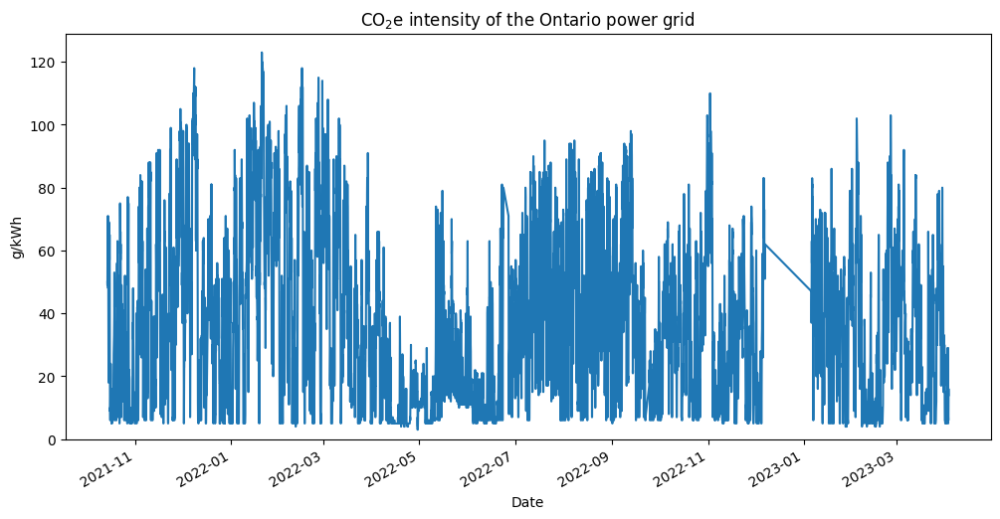
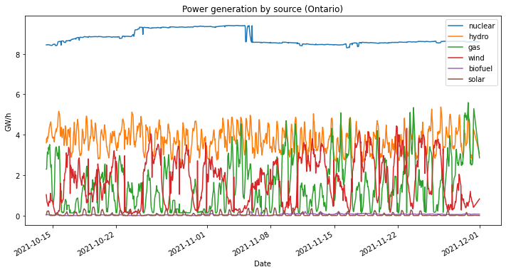

# Gridwatch history

This project downloads hourly data on the Ontario electricity grid from https://gridwatch.ca/. The data is available in `.csv` files in the [data](https://github.com/ryanfobel/gridwatch-history/blob/main/data/) directory. This information can provide insight into how Ontario's power generation mix changes over time (e.g., how much power is provided by nuclear, hydro, wind, solar, biofuel and natural gas) and can be used to estimate the CO$_2$ intensity (i.e., the amount of CO$_2$ emissions generated per kWh of electricity) as a function of time. If you have access to hourly electricity use (e.g., provided by many smart meters and utilities), you can use this data to get a more accurate estimate of you carbon footprint and can estimate the impact of shifting electricity use to times when the grid is "cleaner" (e.g., when it is primarily powered by zero-emission sources).




## Contributors

Ryan Fobel (@ryanfobel)


```python

```
